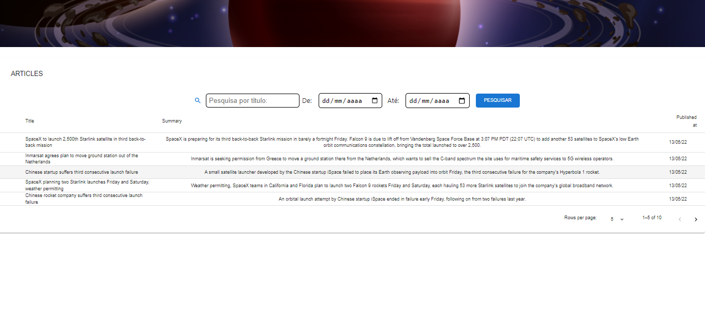

<h1 align="center">Projeto Blog spaceflight</h1>

<p align="center">Projeto realizado para demonstração dos conhecimentos em Reactjs e suas libs para a empresa Sharenergy no processo seletivo de Maio de 2022.</p>

<br/>

<strong >
<a src="https://youtu.be/wOiEWAGgz-w">Link para o video no Youtube.</a>
</strong>

<p align="center">

<a href="#tecnologias">Tecnologias</a>  
<a href="#autor">Autor</a>

</p>

---

<h4 align="center"> 
	🚧  React 🛠️ Finalizado e esperando melhorias...  🚧
</h4>

<h1 align="center">
  
</h1>

---

### Pré-requisitos

Antes de começar, você vai precisar ter instalado em sua máquina as seguintes ferramentas:
[Git](https://git-scm.com), [Node.js](https://nodejs.org/en/).
Além disso, é bom ter um editor para trabalhar com o código como [VSCode](https://code.visualstudio.com/)

---

### 🎲 Rodando o Projeto em sua máquina local

```bash
# Clone este repositório
$ git clone <https://github.com/Lt-lopes1994/desafio-sharenergy-2022-01/tree/Bruno-Mantovan_lopes>

# Acesse a pasta do projeto no terminal/cmd
$ cd share-energy

# Instale as dependências
$ npm install

# Execute a aplicação com o react
$ npm start

# Caso o não se inicie em seu navegador basta acessar a porta:3000 - acesse <http://localhost:3000>
```

### 🛠 Tecnologias

As seguintes ferramentas foram usadas na construção do projeto:

- [Material-UI](https://material-ui.com/)
- [Node.js](https://nodejs.org/en/)
- [React](https://pt-br.reactjs.org/)
- [date-fns](https://date-fns.org/)

### Autor

---

<div align="center" >
 
 <br />
 <sub><b>Bruno Mantovan Lopes</b></sub></a>

Feito com muita paciência e dedicação por <b>Bruno Mantovan Lopes</b>

[](https://www.linkedin.com/in/bruno-mantovan-lopes-c501a54tb532/)
[](mailto:brunomantovanlopes@gmail.com)

</div>

---

<div align="center">


Copyright (c) <2020> <Seu Nome>

Permission is hereby granted, free of charge, to any person obtaining a copy
of this software and associated documentation files (the "Software"), to deal
in the Software without restriction, including without limitation the rights
to use, copy, modify, merge, publish, distribute, sublicense, and/or sell
copies of the Software, and to permit persons to whom the Software is
furnished to do so, subject to the following conditions:

The above copyright notice and this permission notice shall be included in all
copies or substantial portions of the Software.

THE SOFTWARE IS PROVIDED "AS IS", WITHOUT WARRANTY OF ANY KIND, EXPRESS OR
IMPLIED, INCLUDING BUT NOT LIMITED TO THE WARRANTIES OF MERCHANTABILITY,
FITNESS FOR A PARTICULAR PURPOSE AND NONINFRINGEMENT. IN NO EVENT SHALL THE
AUTHORS OR COPYRIGHT HOLDERS BE LIABLE FOR ANY CLAIM, DAMAGES OR OTHER
LIABILITY, WHETHER IN AN ACTION OF CONTRACT, TORT OR OTHERWISE, ARISING FROM,
OUT OF OR IN CONNECTION WITH THE SOFTWARE OR THE USE OR OTHER DEALINGS IN THE
SOFTWARE.

</div>
